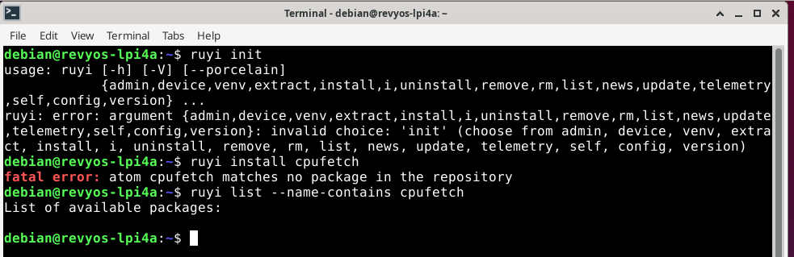

# Ruyi 平台下 cpufetch 安装与使用测试报告

## 一、概述

- **目标**：验证能否通过 Ruyi 包管理器成功安装 `cpufetch` 工具，并在 LicheePi 4A（RevyOS）上正常使用。
- **测试对象**：
  - Ruyi 包管理器（版本 0.20.0 或更高）
  - cpufetch 软件包（若已收录）
- **测试环境**：
  - 硬件：LicheePi 4A（RISC‑V 开发板，CPU T‑Head TH1520）
  - 操作系统：RevyOS（基于 Debian，内核版本 ≥5.10）
  - 架构：`riscv64`

## 二、测试步骤与结果

### 2.1 检查 Ruyi 命令可用性

```bash
ruyi --help
```

**结果**：Ruyi 命令正常工作，支持 `install`、`list` 等子命令。

### 2.2 更新软件源索引

```bash
ruyi update
```

**结果**：成功更新，无报错。

### 2.3 尝试直接安装 cpufetch

```bash
ruyi install cpufetch
```

**预期**：成功下载并安装。  
**实际结果**：报错 `fatal error: atom cpufetch matches no package in the repository`，安装失败。

### 2.4 搜索 cpufetch 包

```bash
ruyi list --name-contains cpufetch
```

**预期**：输出包含 `cpufetch` 的包信息。  
**实际结果**：输出为空，未找到任何匹配包。



## 三、问题分析

- 当前 Ruyi 官方软件源（`packages-index`）中**尚未收录 `cpufetch` 包**。
- Ruyi 的包管理依赖于预定义的包索引，`cpufetch` 作为一个独立的用户态工具，目前未纳入官方维护范围。
- 用户在 RevyOS 上可通过系统包管理器 `apt` 直接安装（源中已有），或从 GitHub 源码编译。

## 四、结论与建议

### 4.1 结论
Ruyi 包管理器暂不支持 `cpufetch` 的一键安装。

### 4.2 建议
1. **临时替代方案**：
   - 使用系统包管理器安装：`sudo apt install cpufetch`（适用于 RevyOS / Debian）。
   - 从源码编译安装：参考 [cpufetch GitHub 仓库](https://github.com/Dr-Noob/cpufetch)。
2. **长期改进方案**：
   - 向 Ruyi 项目提交收录请求：在 [Ruyi packages-index 仓库](https://github.com/ruyisdk/packages-index) 创建 Issue，请求添加 `cpufetch`。
   - 提供必要信息：上游地址、RISC-V 支持情况（从 1.04 起支持）、构建方式（Makefile）、版本号等。
